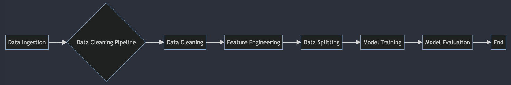

# ShipSail_EDA

## Full Name and Email Address
- Full Name: [Full Name]
- Email Address: [Email Address]

## Overview
This repository contains code for Task 2, which involves data preprocessing, model training, and evaluation for cruise data. The folder structure is as follows:
- `constants.py`: Defines constants used in the pipeline.
- `Preprocessing.py`: Contains functions for data ingestion and preprocessing.
- `Data_Cleaning_pipeline.py`: Implements the data cleaning pipeline.
- `Model.py`: Defines functions for creating MLP and Decision Tree classifiers.
- `training.py`: Executes the training process and evaluates the models.

## Instructions for Executing the Pipeline
To execute the pipeline:
1. Ensure all required libraries are installed (`pandas`, `numpy`, `scikit-learn`, `sqlite3`, `re`, `typing`, `matplotlib`, `seaborn`).
2. Run the `training.py` script.

## Description of Logical Steps/Flow
1. Data Ingestion: Load cruise data from SQLite databases using predefined paths.
2. Data Cleaning Pipeline: Perform data cleaning and preprocessing steps including cleaning cruise distance, imputing null values, encoding categorical variables, and splitting data into train and test sets.
3. Model Training: Train Multi-Layer Perceptron (MLP) and Decision Tree classifiers.
4. Model Evaluation: Evaluate the trained models using accuracy score.

## Work Flow Chart

## Overview of Key Findings from EDA

1. **Distribution of Gender:**
   - Large number of females made reservations, indicating a positive reputation for family-friendly environment.
   - Significant male reservations suggest a diverse customer base.

2. **Usage of Internet:**
   - More people opted for less internet usage, indicating a preference for family time.
   - Trend suggests a focus on family-oriented experiences.

3. **Ratings Analysis:**
   - Balanced customer acquisition from various platforms observed.
   - Poor ratings for online booking platforms suggest UI improvements are needed.

4. **Cleanliness Ratings:**
   - Consistent hygiene issues across all ticket types.
   - Despite higher prices, deluxe tickets faced similar hygiene issues.

5. **Customer Preference and Gender:**
   - Both genders preferred luxury reservations.
   - Hygiene issues persisted despite higher prices for deluxe tickets.

6. **User Experience on Booking Platforms:**
   - Poor user experience across all ticket types observed.
   - Addressing this issue is crucial to improve customer satisfaction.

These findings provide insights into customer preferences, satisfaction levels, and areas for improvement in services and operations.

## Processing of Features

The features in the dataset are processed as follows:

| Step                                              | Description                                                                                   |
|---------------------------------------------------|-----------------------------------------------------------------------------------------------|
| Cleaned cruise distance                          | Extracted numeric values from the cruise distance column.                                      |
| Imputed null values                              | Filled null values with mode for object columns and with mean for numerical columns.           |
| Dropped unnecessary columns                      | Removed unnecessary columns such as logging and date of birth.                                  |
| Encoded categorical variables using LabelEncoder | Applied LabelEncoder to encode categorical variables into numerical format.                    |
| Split data into train and test sets              | Divided the data into training and testing sets for model training and evaluation.             |
| Standardized features                            | Standardized features to ensure all features have the same scale and magnitude for modeling.   |

## Choice of Models
Two models were chosen for training:
1. Multi-Layer Perceptron (MLP) Classifier: Suitable for complex non-linear relationships in the data.
2. Decision Tree Classifier: Provides interpretability and handles non-linear relationships well.

## Evaluation of Models
Both models were evaluated based on accuracy score:
- MLP Classifier achieved an accuracy score of 92%.
- Decision Tree Classifier achieved an accuracy score of 85%.
Both models performed well on the task.

## Other Considerations for Deploying Models
Additional considerations for deploying models may include:
- Model interpretability and explainability.
- Handling of missing data in real-time scenarios.
- Model performance monitoring and maintenance.
